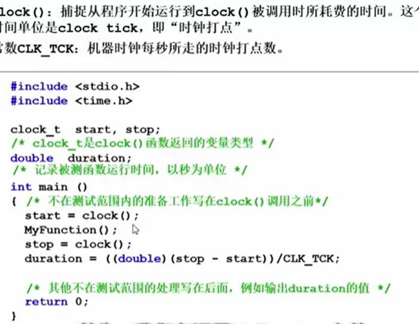

# 数据结构

## 1. 基本概念

解决问题的效率，跟数据的组织方式直接相关

解决问题的效率，跟空间的利用效率有关

c语言里的计算执行时间：

### 1.1 什么是数据结构？

**数据对象**在计算机中的组织方式：

- 逻辑结构（线性，树形，图）
- 物理存储结构

数据对象必定与一系列加在其上的操作相关联，完成这些操作所用的方法就是算法

描述数据结构的方法：抽象数据类型 （Abstract Data Type）

**数据类型：**

- 数据对象集（图书）

- 数据集合相关联的操作集（图书的摆放，它的操作）

**抽象：**描述数据类型的方法不依赖于具体实现

- 与存放数据的机器无关
- 与数据存储的物理结构无关
- 与实现操作的算法和编程语言无关

只描述数据对象集和相关操作集“**是什么**”，并不涉及“**如何做到**”的问题

例子：“矩阵”的抽象数据类型定义

- 类型名称：矩阵（Matrix)

- 数据对象集：一个MXN的矩阵$A_{M*N}$=（$a_{ij}$）(i=1,...,M；即，...,N)由MXN个三元组<a,i,j>构成，其中a是矩阵元素的值，i是元素所在的行号，j是元素所在的列号

- 操作集：对于任意的矩阵A,B,C属于Matrix，以及整数i，j，M，N

  Matrix Create（int M，int N）：返回一个MXN的空矩阵 。。。。等等

### 1.2 算法

算法（Algorithm）：

- 一个有限指令集
- 接受一些输入（有些情况下不需要）
- 产生输出
- 一定在有限步骤后终止

什么是好的算法：

- **空间复杂度S(n)：**根据算法写成的程序在执行时间**占用存储单元**的长度，这个长度往往与输入数据的规模有关。空间复杂度过高的算法可能导致使用的内存超限，造成程序非正常中断。
- **时间复杂度T(n)：**根据算法写成的程序在执行时**耗费时间的长度**。这个长度往往也与输入数据的规模有关。时间复杂度过高的低效算法可能导致我们在有生之年都等不到运行结果

