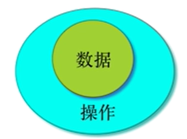

# Mooc: 面向对象程序设计——Java语言

## 1. 类与对象

### 1.1 用类制造对象

**类和对象的关系**：<u>类定义了对象长什么样，对象则是按照类的定义所制造出来的实体，一个类可以创建很多对象，每个对象有自己的数据</u>。

对象：（这只猫）

- 表达东西或事件
- 运行时响应消息（提供服务）

类：（猫）

- 定义所有猫的属性
- 就是Java中的类型
- 可以用来定义变量

对象 = 属性 + 服务； 数据：属性或状态； 操作：函数

**封装：**把对象和对数据的操作放在一起

### 1.2 定义类

**一个类由两种东西组成：表示对象有什么的成员变量和表示对象能做什么的成员函数。**

一旦定义了类，我们就可以创建这个类的多个对象，这些对象都会做那个类所定义的动作（函数），但是各自具有不同的数据

### 1.3 成员变量和成员函数

面向过程和面向对象：在没有引入类之前，变量是跟着代码走的。代码写到哪儿，变量写在哪里，那么运行的时候变量就在那儿。现在，写在类里的成员变量，只是一个声明，变量并不在那里，变量不在类里，变量在每一个对象里。

成员变量：类定义了对象中所具有的变量，这些变量称作成员变量。每个对象有自己的变量，和同一个类的其他对象是分开的。

函数与成员变量:

- 在函数中可以直接写成员变量的名字来访问
- 究竟访问那个对象的成员变量是通过函数调用来确定的，函数时通过对象来调用的

本地变量：定义在函数内部

本地变量的生存期和作用域都是函数内部

成员变量的生存期是对象的生存期，作用域是类内部的成员函数

### 1.4 对象初始化

成员变量的初始化：

- 在定义的地方就可以给出初始值
- 没有给出初始值的成员变量会自动获得0值
- 对象变量的0值表示没有管理任何对象，也可以主动给null值
- 定义初始化可以调用函数，甚至可以使用已经定义的成员变量

**构造函数：**如果有一个成员函数的名字与类的名字完全相同，则在创建这个类的没一个对象的时候会自动调用这个函数，就是构造函数。是没有返回类型的

#### 函数重载：

- 一个类可以由多个构造函数，只要他们的参数表不同
- 创建对象的时候给出不同的参数值，就会自动调用不同的构造函数
- 在某个构造函数里通过this（）还可以调用其他构造函数
- 一个类的同名但参数表不同的函数构成了重载关系

## 2. 对象交互

### 2.1 交互

面向对象程序设计的第一步，就是在问题领域中识别出有效的对象，然后从识别出的对象中抽象出类来。面对纷繁复杂的现实问题，往往存在多种对象划分的方式，而不同的划分会带来类的设计以至于程序结构的各种不同。对象划分有一些理论，但是不是这门面向对象的入门课程能覆盖的。而且目前的理论也还不是放诸四海皆准的简单操作指南。

**一个对象当然可以由其他类的对象来组成，就像一个人体里面有心脏、肠胃一样。对象是由其他对象组成的，而类定义了这样的组合关系。**

那么下一个问题，就是**当一个对象里有多个对象的时候，那些对象之间是如何交互的，对象和对象之间的联系是如何建立的，对象如何和其他对象交流。对象和对象之间的联系紧密程度叫做耦合。**对象和对象的耦合程度越紧，表现在源代码上，就是它们的代码是互相依赖、互相牵制的。**我们理想的模型，是对象和对象之间的耦合要尽可能的松，平行的对象要尽量减少直接联系，让更高层次的对象来提供通信服务。**

### 2.2 访问属性

**封装，就是把数据和对这些数据的操作放在一起，并且用这些操作把数据掩盖起来，是面向对象的基本概念之一，也是最核心的概念。**

我们有一个非常直截了当的手段来保证在类的设计的时候做到封装：

- 所有的成员变量必须是private的，这样就避免别人任意使用你的内部数据；

- 所有public的函数，只是用来实现这个类的对象或类自己要提供的服务的，而不是用来直接访问数据的。除非对数据的访问就是这个类及对象的服务。简单地说，给每个成员变量提供一对用于读写的get/set函数也是不合适的设计。

**private：**

- 只有这个类内部可以访问
- 类内部指类的成员函数和定义初始化
- 这个限制是对类的而不是对对象的

**public：**

- 任何人都可以访问
- 任何人指的是在任何类的函数或定义初始化中可以使用
- 使用指的是调用，访问或定义变量

**friendly（缺省）：**

- 和它位于同一个包的可以访问

### 2.3 包

当你的程序越来越大的时候，你就会需要有一个机制帮助你管理一个工程中众多的类了。**包就是Java的类库管理机制，它借助文件系统的目录来管理类库，一个包就是一个目录，一个包内的所有的类必须放在一个目录下，那个目录的名字必须是包的名字。**

作为初学者，你可以忽略不看包，反正一切靠Eclipse。但是作为一个Java程序员，你不能不懂包。要不然，在使用别人的类库和部署你的程序的时候，会遇到不少莫名其妙的麻烦。

- 跟你不在一个包的，就要import

### 2.4 类变量

类是描述，对象是实体。在类里所描述的成员变量，是位于这个类的每一个对象中的。

而如果**某个成员有static关键字做修饰，它就不再属于每一个对象，而是属于整个类的了，叫类变量。**

通过每个对象都可以访问到这些类变量和类函数，但是也可以通过类的名字来访问它们。**类函数由于不属于任何对象，因此也没有办法建立与调用它们的对象的关系，就不能访问任何非static的成员变量和成员函数了。**

- static的函数只能访问static的函数，只能访问static的变量

## 3. 对象容器

容器是现代程序设计非常基础而重要的手段。

所谓容器，就是“放东西的东西”。数组可以看作是一种容器，但是数组的元素个数一旦确定就无法改变，这在实际使用中是很大的不足。一般意义上的容器，是指具有自动增长容量能力的存放数据的一种数据结构。在面向对象语言中，这种数据结构本身表达为一个对象。所以才有“放东西的东西”的说法。

Java具有丰富的容器，Java的容器具有丰富的功能和良好的性能。熟悉并能充分有效地利用好容器，是现代程序设计的基本能力。

我们首先学习的是顺序容器，即放进容器中的对象是按照指定的顺序（放的顺序）排列起来的，而且允许具有相同值的多个对象存在。

**在一些书中，将容器（英文为collection或container）翻译为“集合”，由于数学中的集合（Set）也是一种特定的容器类型，我们认为将collection翻译为集合是不恰当的。所以我们只会使用容器一词。**

### 3.1 顺序容器

容器类有两个类型：

- 容器的类型
- 元素的类型

### 3.2 对象数组

当数组的元素的类型是类的时候：

- 数组的每一个元素其实只是对象的管理者而不是对象本身。

- 因此，仅仅创建数组并没有创建其中的每一个对象！

### 3.3 集合容器（Set）

集合就是数学中的集合的概念：所有的元素都具有唯一的值，元素在其中没有顺序。

### 3.4 散列表（Hash）

传统意义上的Hash表，是能以int做值，将数据存放起来的数据结构。Java的Hash表可以以任何实现了hash()函数的类的对象做值来存放对象。

Hash表是非常有用的数据结构，熟悉它，充分使用它，往往能起到事半功倍的效果。

## 4. 继承与多态

### 4.1 继承

面向对象程序设计语言有三大特性：**封装、继承和多态性。**继承是面向对象语言的重要特征之一，没有继承的语言只能被称作“使用对象的语言”。继承是非常简单而强大的设计思想，它提供了我们代码重用和程序组织的有力工具。

**类是规则，用来制造对象的规则。我们不断地定义类，用定义的类制造一些对象。类定义了对象的属性和行为，就像图纸决定了房子要盖成什么样子。**

一张图纸可以盖很多房子，它们都是相同的房子，但是坐落在不同的地方，会有不同的人住在里面。假如现在我们想盖一座新房子，和以前盖的房子很相似，但是稍微有点不同。任何一个建筑师都会拿以前盖的房子的图纸来，稍加修改，成为一张新图纸，然后盖这座新房子。所以一旦我们有了一张设计良好的图纸，我们就可以基于这张图纸设计出很多相似但不完全相同的房子的图纸来。

基于已有的设计创造新的设计，就是面向对象程序设计中的继承。

- 在继承中，新的类不是凭空产生的，而是基于一个已经存在的类而定义出来的。
- 通过继承，新的类自动获得了基础类中所有的成员，包括成员变量和方法，包括各种访问属性的成员，无论是public还是private。
- 当然，在这之后，程序员还可以加入自己的新的成员，包括变量和方法。显然，通过继承来定义新的类，远比从头开始写一个新的类要简单快捷和方便。继承是支持代码重用的重要手段之一。

类这个词有分类的意思，具有相似特性的东西可以归为一类。比如所有的鸟都有一些共同的特性：有翅膀、下蛋等等。鸟的一个子类，比如鸡，具有鸟的所有的特性，同时又有它自己的特性，比如飞不太高等等；而另外一种鸟类，比如鸵鸟，同样也具有鸟类的全部特性，但是又有它自己的明显不同于鸡的特性。

如果我们用程序设计的语言来描述这个鸡和鸵鸟的关系问题，首先有一个类叫做“鸟”，它具有一些成员变量和方法，从而阐述了鸟所应该具有的特征和行为。然后一个“鸡”类可以从这个“鸟”类派生出来，它同样也具有“鸟”类所有的成员变量和方法，然后再加上自己特有的成员变量和方法。无论是从“鸟”那里继承来的变量和方法，还是它自己加上的，都是它的变量和方法。

### 4.2 子类父类关系

对理解继承来说，最重要的事情是，知道哪些东西被继承了，或者说，子类从父类那里得到了什么。

**答案是：所有的东西，所有的父类的成员，包括变量和方法，都成为了子类的成员，除了构造方法。构造方法是父类所独有的，因为它们的名字就是类的名字，所以父类的构造方法在子类中不存在。除此之外，子类继承得到了父类所有的成员。**

但是得到不等于可以随便使用。每个成员有不同的访问属性，子类继承得到了父类所有的成员，但是不同的访问属性使得子类在使用这些成员时有所不同：有些父类的成员直接成为子类的对外的界面，有些则被深深地隐藏起来，即使子类自己也不能直接访问。下表列出了不同访问属性的父类成员在子类中的访问属性：

| **父类成员访问属性** | **在父类中的含义**                 | **在子类中的含义**                                           |
| -------------------- | ---------------------------------- | ------------------------------------------------------------ |
| public               | 对所有人开放                       | 对所有人开放                                                 |
| protected            | 只有包内其它类、自己和子类可以访问 | 只有包内其它类、自己和子类可以访问                           |
| 缺省                 | 只有包内其它类可以访问             | 如果子类与父类在同一个包内：只有包内其它类可以访问否则：相当于private，不能访问 |
| private              | 只有自己可以访问                   | 不能访问                                                     |

public的成员直接成为子类的public的成员，protected的成员也直接成为子类的protected的成员。Java的protected的意思是**包内和子类可访问**，所以它比缺省的访问属性要宽一些。而对于父类的缺省的未定义访问属性的成员来说，**他们是在父类所在的包内可见**，如果子类不属于父类的包，那么在子类里面，这些缺省属性的成员和private的成员是一样的：不可见。父类的private的成员在子类里仍然是存在的，只是子类中不能直接访问。我们不可以在子类中重新定义继承得到的成员的访问属性。如果我们试图重新定义一个在父类中已经存在的成员变量，那么我们是在定义一个与父类的成员变量完全无关的变量，在子类中我们可以访问这个定义在子类中的变量，在父类的方法中访问父类的那个。尽管它们同名但是互不影响。

**在构造一个子类的对象时，父类的构造方法也是会被调用的，而且父类的构造方法在子类的构造方法之前被调用。**在程序运行过程中，子类对象的一部分空间存放的是父类对象。因为子类从父类得到继承，在子类对象初始化过程中可能会使用到父类的成员。所以父类的空间正是要先被初始化的，然后子类的空间才得到初始化。在这个过程中，如果父类的构造方法需要参数，如何传递参数就很重要了。

**构造子类的时候，自动调用父类的构造器，没有传参数会自动去找父类没有参数的构造器**

### 4.3 多态变量和向上造型

类定义了类型,DVD类所创建的对象的类型就是DVD。类可以有子类,所以由那些类定义的类型可以有子类型。在DoME的例子中,DVD类型就是Item类型的子类型。

子类型类似于类的层次,类型也构成了类型层次。子类所定义的类型是其超类的类型的子类型。

当把一个对象赋值给一个变量时,对象的类型必须与变量的类型相匹配,如:

  Car myCar = new Car(); 

是一个有效的赋值,因为Car类型的对象被赋值给声明为保存Car类型对象的变量。但是由于引入 了继承,这里的类型规则就得叙述得更完整些:

  **一个变量可以保存其所声明的类型或该类型的任何子类型。**

对象变量可以保存其声明的类型的对象,或该类型的任何子类型的对象。

Java中保存对象类型的变量是多态变量。“多态”这个术语(字面意思是许多形态)是指一个变量可以保存不同类型(即其声明的类型或任何子类型)的对象。

#### 4.3.1 子类和子类型

类定义了类型，子类定义了子类型，子类的对象可以被当做父类的对象来使用。比如：

- 赋值给父类的变量
- 传递给需要父类对象的函数
- 放进存放父类对象的容器里

#### 4.3.2  多态变量

- java的对象变量是多态的，它们能保存不止一种类型的对象（在它运行的时候，它具体管理的那个变量类型可以有多种，比如父类就可以管理子类的）
- 它们可以保存的是声明类型的对象，或声明类型的子类的对象
- 当把子类的对象赋给父类的变量的时候，就发生了向上造型

#### 4.3.3 造型cast

- 子类的对象可以赋值给父类的变量
  - 注意！java中不存在对象对对象的赋值
- 父类的对象不能赋值给子类的变量
- 可以用造型 c = （Car）v；（只有当v这个变量实际管理的是Car才行）

造型

- 用括号围起类型放在值的前面
- 对象本身并没有发生任何变化，把你当成那个类型看待，不是改成那个类型
  - 所以不是“类型转换”
- 运行时有机制来检查这样的转化是否合理
  - ClassCastException

### 4.4 多态

如果子类的方法覆盖了父类的方法，我们也说父类的那个方法在子类有了新的版本或者新的实现。覆盖的新版本具有与老版本相同的方法签名：相同的方法名称和参数表。因此，对于外界来说，子类并没有增加新的方法，仍然是在父类中定义过的那个方法。不同的是，这是一个新版本，所以通过子类的对象调用这个方法，执行的是子类自己的方法。

覆盖关系并不说明父类中的方法已经不存在了，而是当通过一个子类的对象调用这个方法时，子类中的方法取代了父类的方法，父类的这个方法被“覆盖”起来而看不见了。而当通过父类的对象调用这个方法时，实际上执行的仍然是父类中的这个方法。注意我们这里说的是对象而不是变量，因为一个类型为父类的变量有可能实际指向的是一个子类的对象。

**当调用一个方法时，究竟应该调用哪个方法，这件事情叫做绑定。**绑定表明了调用一个方法的时候，我们使用的是哪个方法。**绑定有两种：一种是早绑定，又称静态绑定，这种绑定在编译的时候就确定了；另一种是晚绑定，即动态绑定。动态绑定在运行的时候根据变量当时实际所指的对象的类型动态决定调用的方法。Java缺省使用动态绑定。**

函数调用的绑定：

- 当通过对象变量调用函数的时候，调用哪个函数这件事情叫做绑定
- 静态绑定：根据变量的声明类型来决定
- 动态绑定：根据变量的动态类型来决定
- 在成员函数中调用其他成员函数也是通过this这个对象变量来调用的

覆盖override：

- 子类和父类中存在名称和参数表完全相同的函数，这一对函数构成覆盖关系
- 通过父类的变量调用存在覆盖关系的函数时，会调用变量当时所管理的对象所属的类的函数

## 5. 设计原则

### 5.1 消除代码复制

程序中存在相似甚至相同的代码块，是非常低级的代码质量问题。

代 码复制存在的问题是，如果需要修改一个副本，那么就必须同时修改所有其他的副本，否则就 存在不一致的问题。这增加了维护程序员的工作量，而且存在造成错误的潜在危险。很可能发 生的一种情况是，维护程序员看到一个副本被修改好了，就以为所有要修改的地方都已经改好 了。因为没有任何明显迹象可以表明另外还有一份一样的副本代码存在，所以很可能会遗漏还 没被修改的地方。

我们从消除代码复制开始。**消除代码复制的两个基本手段，就是函数和父类。**

### 5.2 封装

要评判某些设计比其他的设计优秀，就得定义一些在类的设计中重要的术语，以用来讨论 设计的优劣。对于类的设计来说，有两个核心术语：耦合和聚合。 **耦合这个词指的是类和类之间的联系。**之前的章节中提到过，程序设计的目标是一系列通 过定义明确的接口通信来协同工作的类。**耦合度反映了这些类联系的紧密度。我们努力要获得低的耦合度，或者叫作松耦合（loose coupling）**。

耦合度决定修改应用程序的容易程度。在一个紧耦合的结构中，对一个类的修改也会导致 对其他一些类的修改。这是要努力避免的，否则，一点小小的改变就可能使整个应用程序发生 改变。另外，要想找到所有需要修改的地方，并一一加以修改，却是一件既困难又费时的事情。 另一方面，在一个松耦合的系统中，常常可以修改一个类，但同时不会修改其他类，而且 整个程序还可以正常运作。

本周会讨论紧耦合和松耦合的例子。 聚合与程序中一个单独的单元所承担的任务的数量和种类相对应有关，**它是针对类或方法 这样大小的程序单元而言的理想情况下，一个代码单元应该负责一个聚合的任务（也就是说，一个任务可以被看作是 一个逻辑单元）。****一个方法应该实现一个逻辑操作，而一个类应该代表一定类型的实体**。聚合 理论背后的要点是重用：如果一个方法或类是只负责一件定义明确的事情，那么就很有可能在 另外不同的上下文环境中使用。遵循这个理论的一个额外的好处是，当程序某部分的代码需要 改变时，在某个代码单元中很可能会找到所有需要改变的相关代码段。

### 5.3 可扩展性

可扩展性的意思就是代码的某些部分不需要经过修改就能适应将来可能的变化。

增加可扩展性：

- 可以运行的代码！=良好的代码
- 对代码做维护的时候最能看出代码的质量

**用接口来实现聚合**

### 5.4 框架加数据

从程序中识别出框架和数据，以代码实现框架，将部分功能以数据的方式加载，这样能在很大程度上实现可扩展性。

## 6. 抽象与接口

Shape类表达的是一种概念，一种共同属性的抽象集合，我们并不希望任何Shape类的对象会被创建出来。那么，我们就应该把这个Shape类定义为抽象的。我们用abstract关键字来定义抽象类。抽象类的作用仅仅是表达接口，而不是具体的实现细节。抽象类中可以存在抽象方法。抽象方法也是使用abstract关键字来修饰。抽象的方法是不完全的，它只是一个方法签名而完全没有方法体。

### 6.1 抽象函数和抽象类

抽象函数：表达概念而无法实现具体代码的函数

抽象类：表达概念而无法构造出实体的类

- 带有abstrct修饰符的函数，由抽象函数的类一定是抽象类

- 抽象类不能制造变量，但是可以定义变量，任何继承了抽象类的非抽象类的对象可以付给这个变量
- 继承自抽象类的子类必须覆盖父类中的抽象函数

### 6.2 两种抽象

- 与具体相对，表达一种概念而非实体
- 与细节相对，表示在一定程度上忽略细节而着眼大局

### 6.3 数据与表现分离

程序的业务逻辑与表现无关

- 表现可以是图形的也可以是文本的， 表现可以是当地的也可以是远程的

表现与数据的关系

- view只管根据field画出图形，field只管数据的存放
- 一旦数据更新之后，通知view重新画出整个画面，不去精心设计哪个局部需要更新

责任驱动的设计

- 将程序要实现的功能分配到合适的类/对象中去是设计中非常重要的一环

网格化

- 图形界面本身有更高的解析度。但是将画面网格化以后，数据就更容易处理了

### 6.4 接口

接口是纯抽象类

- 所有的成员函数都是抽象函数
- 所有的成员变量都是public static final
- 接口规定了长什么样，但是不管里面有什么

实现接口

- 类可以用extends（继承），接口用implements（实现）
- 类可以实现很多接口，但是不能继承类，接口不能实现接口

面向接口的编程方式

- 设计程序时先定义接口，再实现类
- 任何需要在函数间传入传出的一定时接口而不是具体的类

## 7. 控制反转与MVC

### 7.1 GUI

1. GUI（图形用户界面）给应用程序提供界面,其中包括窗口、菜单、按钮和其他图形组件,这就是今天大多 数人所熟悉的“典型”应用程序界面。

2. 图形用户界面所涉及的细节很多,我们的课程并不打算教授GUI，但是我们打算借助GUI来介绍两个设计思想：控制反转和MVC设计模式。

3. 部件是创建GUI的独立部分,比如像按钮、菜单、菜单项、选择框、滑动条、文本框等。Java类库中有不少现成的部件。

4. 布局是指如何在屏幕上放置组件。过去,大多数简单的GUI系统让程序员在二维坐标系上 指定每个组件的x和y坐标(以像素点为单位),这对于现代的GUI系统来说太简单了。因为现代的GUI系统还得考虑不同的屏幕分辨率、不同的字体、用户可改变的窗口尺寸,以及许多其他使得布局困难的因素。所以需要有一种能更通用地指定布局的方法,比如,要求“这个部件应该在那个部件的下面“或者”这个部件在窗口改变尺寸时能自动拉伸,但是其他部件保持尺寸不变”。这些可以通过布局管理器(layout manager)来实现。

5. 事件处理是用来响应用户输入的技术。创建了部件并且放在屏幕上合适的位置以后,就得 要有办法来处理诸如用户点击按钮这样的事情。Java类库处理这类事情的模型是基于事件的。 如果用户激活了一个部件(比如,点击按钮或者选择菜单项),系统就会产生一个事件。应用程序可以收到关于这个事件的通知(以程序的一个方法被调用的方式),然后就可以采取程序该做的动作了。
6. Swing使用一个非常灵活的模型来处理GUI的输入:采用事件监听器的事件处理(event handling)模型。
7. Swing框架本身以及大部分部件在发生一些情况时会触发相关的事件,而其他的对象也许会对这些事件感兴趣。不同类型的动作会导致不同类型的事件。当点击一个按钮或选中一个菜单项,部件就会触发动作事件;而当点击或移动鼠标时,会触发鼠标事件;当框架被关闭或最小化时,会触发窗口事件。另外还有许多种其他事件。
8. 所有的对象都可以成为任何这些事件的监听器,而一旦成为监听器,就可以得到这些事件触发的通知。
9. 实现了众多监听器接口之一的对象就成为一个事件监听器。如果对象实现了恰当的接口, 就可以注册到它想监听的组件上。

### 7.2 内部类

1. 内部类就是指一个类定义在另一个类的内部，从而成为外部类的一个成员。因此一个类中可以有成员变量、方法，还可以有内部类。
2. 内部类能直接访问外部的全部资源，包括任何私有的成员，外部是函数的，只能访问那个函数里final的变量
3. 实际上Java的内部类可以被称为成员类，内部类实际上是它所在类的成员。所以内部类也就具有和成员变量、成员方法相同的性质。
4. 比如，成员方法可以访问私有变量，那么成员类也可以访问私有变量了。也就是说，成员类中的成员方法都可以访问成员类所在类的私有变量。内部类最重要的特点就是能够访问外部类的所有成员。

### 7.3 匿名类

- 在new对象的时候给出的类的定义形成了匿名类

- 匿名类可以继承某类，也可以实现某接口

- Swing的消息机制广泛使用匿名类

### 7.4 注入反转

- 由按钮公布一个守听者接口和一对注册/注销函数

- 你的代码实现那个接口，将守听者对象注册在按钮上
- 一旦按钮被按下，就会反过来调用你的守听者对象的某个函数

### 7.5 MVC

## 8. 异常处理与输入输出

如果要读文件：

- 打开文件
- 判断文件大小
- 把文件读入内存
- 关闭文件

### 8.1 异常

有不寻常的事情发生了，当这个事情发生的时候，原本打算要接着做的事情不能再继续了，必须得要停下来，让其他地方的某段代码来处理。

什么能扔？

- 任何继承了Throwable类的对象
- Exception类继承了Throwable

catch怎么匹配异常的

- is-A的关系，就是说抛出子类异常会被捕捉父类异常的catch给捉到

异常声明

- 如果你调用一个声明会抛出异常的函数，那么你必须：
- 把函数的调用放在try块中，并设置catch来捕捉所有可能抛出的异常；或
- 声明自己会抛出无法处理的异常

异常声明遇到继承关系

- 当覆盖一个函数的时候，子类不能声明抛出比父类的版本更多的异常
- 再子类的构造函数中，必须声明父类可能抛出的全部异常

### 8.2 流

流是输入输出的方式，是单向的

**文本流**

reader/writer

- 二进制数据采用InputStream/OutputStream
- 文本数据采用Reader/Writer
- BufferReader
- FileReader

**文字编码**

**阻塞/非阻塞**

- read（）函数是阻塞的，在读到所需的内容之前会停下来等
- 使用read()的更“高级”的函数，如nextInt（），readLine（）都是这样的
- 所以常用单独的线程来做socket读的等待，或使用nio的channel选择机制
- 多于socket，可以设置SO时间 setSoTimeout

**对象串行化**

- implements Serializable 接口
- ObjectInputStream类
- ObjectOutputStream类

